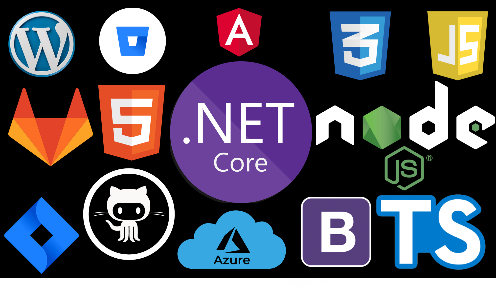

M.F.M Fazrin\
Senior Full-Stack Software Engineer \
MSc in Software Engineering @ [Kingston University - {Reading}](https://www.kingston.ac.uk/) 
-----

<a href="https://github.com/nirzaf/github-readme-stats">
  <!-- Change the `github-readme-stats.anuraghazra1.vercel.app` to `github-readme-stats.vercel.app`  -->
  
</a>

<!--  -->

Working as a Full-Stack Senior Software Engineer @[Quadrate Tech
Solutions](https://quadrate.cc) in Developing Various Web & Desktop
Applications, I use Angular and .NET to
construct well-built high concurrent web applications, and I am
passionate about making the end-user experience as seamless as possible.

Examine my [resume](https://nimb.ws/ZyIWei)
----------------------------

My Familiar Tools & Languages
-----------------------------

 

-----------------------------
My long journey accumulated lots of projects which cannot be listed all
here\
 so please check out my complete list of projects in
[github](https://github.com/nirzaf) and
[gitlab](https://gitlab.com/nirzaf)

#### I am always reachable through WhatsApp

[+94772049123](https://api.whatsapp.com/send?phone=+94772049123&text=Hi,%20I%20contacted%20you%20Through%20your%20website.)

#### [Email : mfmfazrin1986@gmail.com](mailto:mfmfazrin1986@gmail.com) 

[Linkedin](https://www.linkedin.com/in/mfmfazrin/)

Copyright © 2021 - [M.F.M Fazrin](https://nirzaf.github.io)

All trademarks and registered trademarks are the property of their
respective owners.
