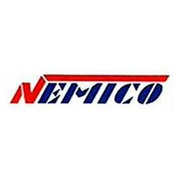

M.F.M\
Fazrin\
Full-Stack\
Developer {#main-title}
===========

-   [**](#profileSection)
-   [**](#projectsSection)
-   [**](#highlightsSection)
-   [**](#contactSection)

Profile
=======

* * * * *

Name: M.F.M Fazrin

* * * * *

Role: Full-Stack Developer

INTRO
-----

* * * * *

\

I am Fazrin. (B.E in Software Engineering @ [London Metropolitan
University](https://www.londonmet.ac.uk)) \
\
Working as a Full-Stack Developer @[Quadrate Tech
Solutions](https://quadrate.cc) in Developing Various Web & Desktop
Applications, Previously I worked @ [Voigue](https://voigue.com) Private
Limited as a .NET Developer mostly developed WPF application with .NET
Core backend, I worked @ [Virtusa](https://virtusa.com) Private Limited
as an Associate Software Engineer & I used Angular and .NET Core to
construct well-built high concurrent web applications, and I am
passionate about making the end-user experience as seamless as possible.

* * * * *

I worked as a Software Developer @[Nemico](#highlight3) Fashion Paradise
(part of parent company [Nemico
Holdings](https://www.linkedin.com/in/nemico-group-of-companies-105480129/?originalSubdomain=lk))
for 3 Years After I left from Olayan @ KSA as a [backend](#highlight4)
developer for 3 years, Since 2009, in my own startup [Quadrate Tech
Solutions](https://quadrate.lk) I still playing the co-founder role,
please check out my [career history](#highlightsSection) &
[portfolio](#projectsSection) section for more details, I was
configuring and troubleshooting computer hardware & networking issues
since 2005. Please refer to the [section](#skills) to explore my
familiar programming languages and tools that I have used\
\
Examine my [resume](https://nimb.ws/ZyIWei)

My Familiar Tools & Languages
-----------------------------

* * * * *

\

  
  
 
 
 
  
  
  
 

Portfolio
=========

* * * * *

### Live samples of my work

Invoice and Certificate Printing for Premadasa Á Co Jewellers (Pvt) Ltd

Pharmacy Management System Web Solution for Pharmacy Management

Website with live chatting features for Heaven Lanka Tours

Complete Point Of Sale with ERP Solution

Online food ordering system for Avon Bakers

Technical blog site for content sharing regarding latest outstanding
technologies by experts

A cat adoption website created with NodeJS, Express, Passport, and
MongoDB

A website similar to Patatap, using HowlerJS

A simple DOM manipulation puzzle game where users try to match RGB
colors

Using jQuery and AJAX GET requests, weather data is shown to the user

A simple To-Do list using jQuery and AJAX requests

A responsive HTML & CSS website

A simple movable CSS monster

A simple Angular website to browse ninjas-for-hire

An Angular quiz website to learn about turtles

An Angular website with a PostgreSQL database to log your physical
training regimen

A MERN stack website to create a bucket list by referencing YouTube
videos

A MEAN stack website for computer-phone text messaging

Website for Aichi Union Vehicle Importers to showcase imported vehicles

Web based smart accounting system

My long journey accumulated lots of projects which cannot be listed all
here\
 so please check out my complete list of projects in
[github](https://github.com/nirzaf) and
[gitlab](https://gitlab.com/nirzaf)

Career History
==============

* * * * *

-   **

    #### [Quadrate](https://quadrate.cc/) {.timeline-title}

    July-2020 - Present

    Full-Stack Developer

    

-   **

    #### [Voigue](https://voigue.com) {.timeline-title}

    Sept 2019 - Jun 2020

    Software Developer

    

-   **

    #### [Virtusa](http://virtusa.com/) {.timeline-title}

    Jan 2019 - Jan 2019

    Associate Engineer

    

-   **

    #### [Nemico Holdings](http://nemico.lk) {.timeline-title}

    Jan 2016 - Dec 2018

    Software Developer

    

Contact
=======

* * * * *

#### I am always reachable through WhatsApp {style="font-display:block;color:white"}

[+94772049123](https://api.whatsapp.com/send?phone=+94772049123&text=Hi,%20I%20contacted%20you%20Through%20your%20website.)

#### Or Drop me an e-mail to {.section-heading style="font-display:block;color:white"}

#### [Email : fazrin@quadrate.lk](mailto:fazrin@quadrate.lk) {.section-heading style="font-display:block"}

[**](https://github.com/nirzaf)
[**](https://www.linkedin.com/in/mfmfazrin/)

Copyright © 2019 - [M.F.M Fazrin](https://nirzaf.github.io)

All trademarks and registered trademarks are the property of their
respective owners.
