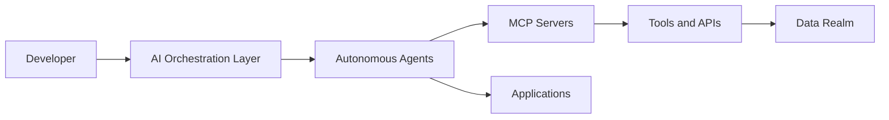
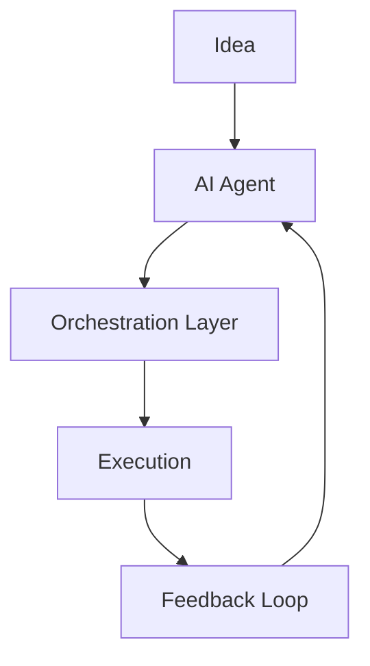

<div align="center">


<a href="https://nizraf.github.io">
  
</a>

<br />

```bash

        ╔══════════════════════════════════════════════════════════════════════════════╗
        ║  🎯 MISSION: ARCHITECTING THE FUTURE OF AUTONOMOUS SOFTWARE SYSTEMS          ║
        ║  📡 STATUS:  BUILDING AI-NATIVE APPLICATIONS WITH MCP PROTOCOL               ║
        ║  ⚡ POWER:   18+ YEARS EXPERIENCE | ∞ INNOVATION                              ║
        ╚══════════════════════════════════════════════════════════════════════════════╝

```


## 🌌 NEURAL NETWORK PROFILE

Here is a **single, clean, copy-paste ready `README.md` file** in Markdown format, fully self-contained and GitHub-renderable.

Just copy everything below into your GitHub profile README.

---

````md
# 🧠 Fazrin AI

> **Senior Full-Stack Software Engineer**  
> **AI Solutions Architect**  
> *Designing autonomous software systems*

---

## 🧬 Identity Matrix

```yaml
Role: Senior Full-Stack Software Engineer
Specialization: AI Solutions Architect
Neural Pathways:
  - Agentic Workflows
  - MCP Servers
  - AI Orchestration
````

---

## 🚀 Evolution Path

```yaml
Experience: 18 Years
Paradigm Shift: Traditional Development → AI Native Architecture
Current Focus: Autonomous Agent Systems
```

---

## 🧠 Core Belief

> **The future is not AI replacing developers — it is developers orchestrating AI agents.**

---

## 🏗️ AI Native Architecture


```mermaid
flowchart LR
    Dev[Developer] --> Orchestrator[AI Orchestration Layer]
    Orchestrator --> Agents[Autonomous Agents]
    Agents --> MCP[MCP Servers]
    MCP --> Tools[Tools and APIs]
    Tools --> Data[Data Realm]
    Agents --> Apps[Applications]
```

---

## 🎯 Current Mission

> **Building MCP servers that make AI agents truly autonomous 🚀**

---

## 🧩 Intelligence Loop


```mermaid
flowchart TB
    Idea[Idea] --> Agent[AI Agent]
    Agent --> Orchestrate[Orchestration Layer]
    Orchestrate --> Execute[Execution]
    Execute --> Learn[Feedback Loop]
    Learn --> Agent
```

---

## 🏆 Positioning

> **From writing code to designing intelligence.**
> **From building apps to building autonomous systems.**

---

<div align="center">

</div>

## ⚡ AI-NATIVE DEVELOPMENT ARSENAL

<div align="center">

### 🤖 AGENTIC AI ECOSYSTEM

<table border="0">
<tr>
<td align="center" width="33%" valign="top">

**🧠 AI-NATIVE IDEs**

<br>

<br><br>

`Cursor` • `Windsurf` • `Trae`

*Next-generation IDEs that think*

</td>
<td align="center" width="33%" valign="top">

**🌐 LLM ORCHESTRATION**

<br>

<br><br>

`Codex` • `Claude` • `Gemini`

*Multi-model intelligence layer*

</td>
<td align="center" width="33%" valign="top">

**⚙️ AGENTIC PROTOCOLS**

<br>

<br><br>

`MCP Servers` • `AI Agents`

*Autonomous system orchestration*

</td>
</tr>
</table>

### 💎 CORE TECHNOLOGY MATRIX


</div>

<br>

<div align="center">

<table>
<tr>
<th align="center">🛡️ BACKEND FORTRESS</th>
<th align="center">⚔️ FRONTEND ARSENAL</th>
<th align="center">☁️ CLOUD EMPIRE</th>
</tr>
<tr>
<td valign="top">
⚙️ .NET Core / C#<br>
🟢 Node.js<br>
🎯 Microservices<br>
🔌 GraphQL / REST<br>
🛡️ Identity Server
</td>
<td valign="top">
⚛️ Next.js 15+<br>
⚛️ React 19<br>
📘 TypeScript<br>
🎨 TailwindCSS<br>
🎭 Server Comps
</td>
<td valign="top">
☁️ Azure Cloud<br>
🌩️ Vercel Edge<br>
🐳 Docker / K8s<br>
📦 Railway<br>
🔒 Cloudflare R2
</td>
</tr>
</table>


</div>

## 🛸 E-COMMERCE HYPERDRIVE

<div align="center">

<table>
<tr>
<td width="33%" align="center" valign="top">


### 🏪 PLATFORMS

`Medusa.js` • `Saleor`
<br>
*Headless Architecture*

</td>
<td width="33%" align="center" valign="top">


### 💾 DATABASES

`PostgreSQL` • `Neon`
<br>
*Multi-cloud Persistence*

</td>
<td width="33%" align="center" valign="top">


### 💳 PAYMENTS

`Stripe` • `PayPal`
<br>
*Global Orchestration*

</td>
</tr>
</table>

</div>

<div align="center">

</div>

## 🎯 SPECIALIZATION MATRIX

<div align="center">

```diff
@@  AI SOLUTIONS ARCHITECT  @@
+ Designing autonomous agentic workflows using Model Context Protocol (MCP)
+ Building AI-native applications that self-optimize and self-heal
+ Integrating multi-modal LLMs for complex decision-making systems

@@  NEXT-GEN DEVELOPMENT PARADIGM  @@
+ Expert in Cursor, Windsurf, and Trae for AI-assisted development
+ Leveraging OpenAI Codex and Claude Sonnet for intelligent refactoring
+ Implementing AI pair programming patterns for 10x productivity

@@  DISTRIBUTED SYSTEMS ARCHITECT  @@
+ Microservices architecture with .NET Core and Node.js
+ Event-driven systems using RabbitMQ, Redis, and Azure Service Bus
+ CQRS and Event Sourcing patterns for high-scale applications

@@  CLOUD-NATIVE INFRASTRUCTURE  @@
+ Azure ecosystem: App Services, Functions, Container Apps, AKS
+ Cloudflare R2 for distributed object storage
+ Infrastructure as Code with Terraform and Bicep
```

</div>

<div align="center">


## 🚀 FEATURED PROJECTS & INNOVATIONS

<table>
<tr>
<td width="50%" valign="top">

### 🤖 AI AGENT ORCHESTRATOR

```yaml
Status: 🟢 Production
Stack:  MCP | Python | LLM APIs
Impact: 70% reduction in manual
        data processing
```

**Key Features:**

  - 🔄 Auto-syncing agent workflows
  - 🧠 Context-aware decision making

</td>
<td width="50%" valign="top">

### 🏢 ENTERPRISE MICROSERVICES

```yaml
Status: 🟢 Production
Stack:  .NET Core | Azure | K8s
Impact: 99.99% uptime with
        auto-scaling efficiency
```

**Key Features:**

  - 🔐 Zero-trust security model
  - ⚡ Sub-100ms response times

</td>
</tr>
<tr>
<td width="50%" valign="top">

### 🛒 HEADLESS E-COMMERCE

```yaml
Status: 🟢 Production
Stack:  Next.js | Medusa | Stripe
Impact: 3x conversion rate
        improvement
```

**Key Features:**

  - 🎯 Personalized shopping UX
  - 📱 Progressive Web App

</td>
<td width="50%" valign="top">

### 🔮 AI WORKFLOW AUTOMATION

```yaml
Status: 🟡 Beta
Stack:  LangChain | FastAPI | React
Impact: Democratizing AI
        development
```

**Key Features:**

  - 🎨 Visual workflow designer
  - 🔌 100+ integration plugins

</td>
</tr>
</table>


</div>

## 📊 NEURAL NETWORK STATISTICS

<div align="center">


<br>


</div>

## 🌐 CONNECT TO THE MATRIX

<div align="center">

### 📡 PRIMARY CHANNELS

<a href="https://www.linkedin.com/in/mfmfazrin/">

</a>
<a href="https://stackoverflow.com/users/9251463/mohamed-farook-mohamed-fazrin">

</a>
<a href="https://mfmfazrin.medium.com/">

</a>
<a href="https://github.com/nirzaf?tab=repositories">

</a>

### 💬 DIRECT TRANSMISSION

<a href="https://api.whatsapp.com/send?phone=+97433253203&text=Hi,%20I%20contacted%20you%20Through%20your%20website.">

</a>
<a href="tel:+97433253203">

</a>
<a href="mailto:info@dotnetevangelist.net">

</a>

<br><br>


</div>

## 🎓 KNOWLEDGE BASE & CERTIFICATIONS

<div align="center">

```
┌─────────────────────────────────────────────────────────────┐
│  🎓 MSc Software Engineering @ Kingston University          │
│  🏆 Microsoft Certified: Azure Solutions Architect Expert   │
│  🏆 AWS Certified Solutions Architect                       │
│  🏆 Google Cloud Professional Architect                     │
└─────────────────────────────────────────────────────────────┘
```

</div>

<div align="center">

## 💭 PHILOSOPHY

> *"In the age of AI, the most valuable skill isn't writing code—it's orchestrating intelligent systems that write, debug, and optimize themselves. We're not replacing developers; we're evolving into AI conductors."*

```bash
root@AI-Architect:~$ ./manifesto.sh

> "I don't just build applications.
   I architect autonomous systems that
   THINK, LEARN, and EVOLVE."

[ STATUS: ONLINE & EVOLVING ] 🟢
```


-----

<sub>⚡ Powered by AI • Built with 💙 • Updated via GitHub Actions</sub>

**© 2025 M.F.M Fazrin** | [Website](https://nizraf.github.io) | Last Neural Sync: `2025-12-03`

</div>
